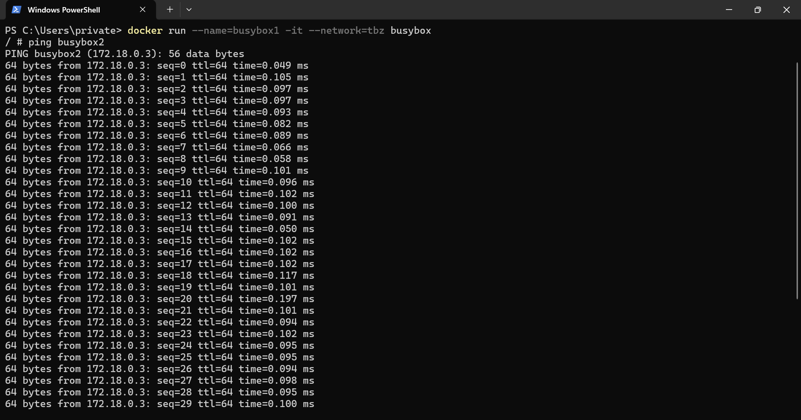
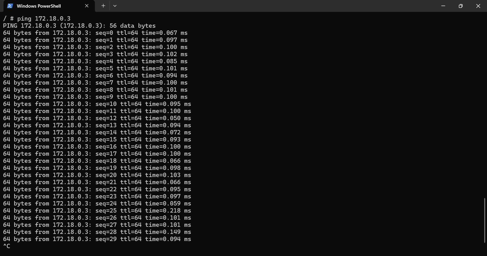
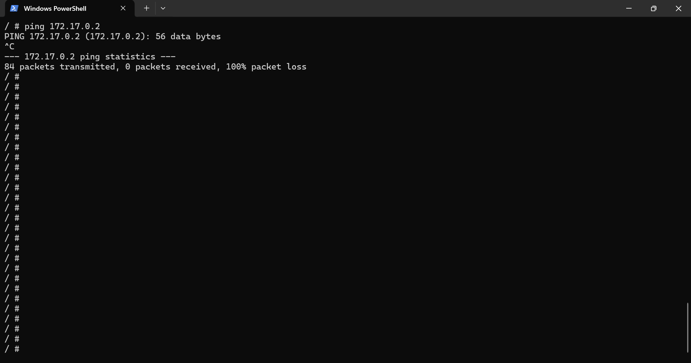
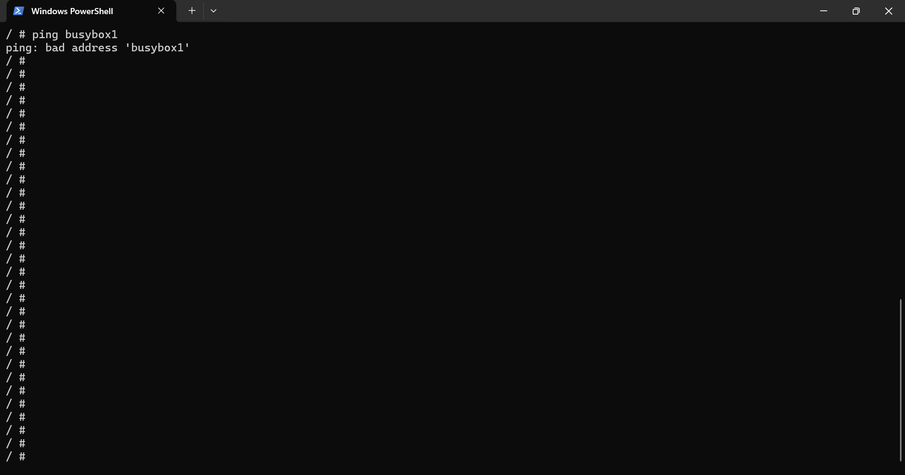
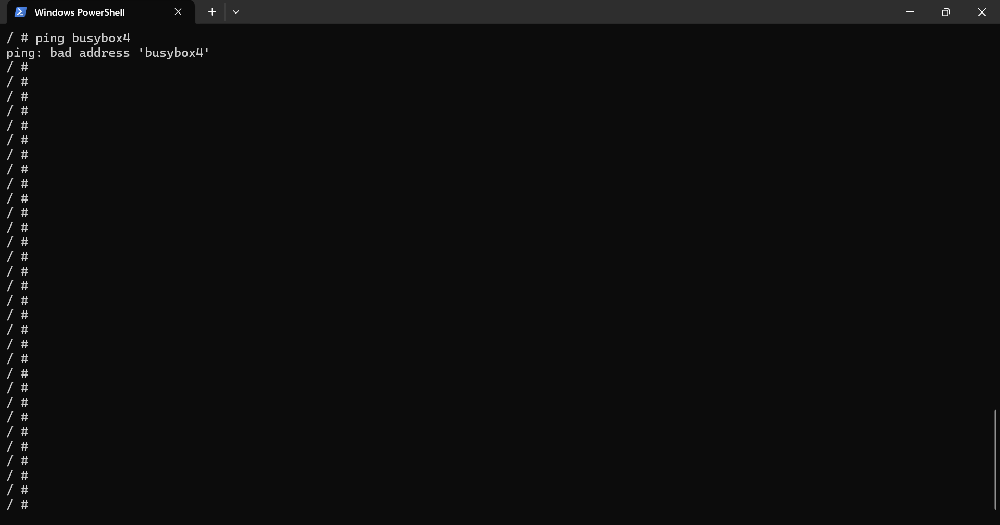
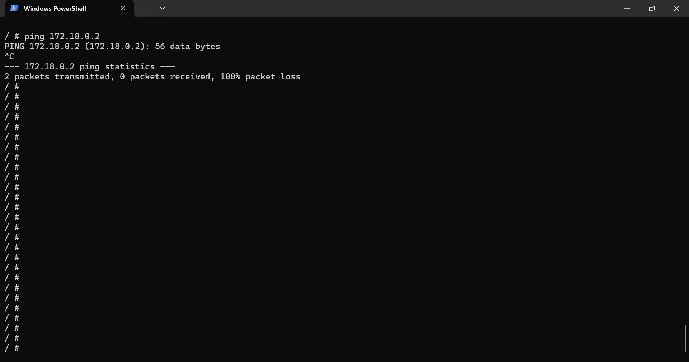
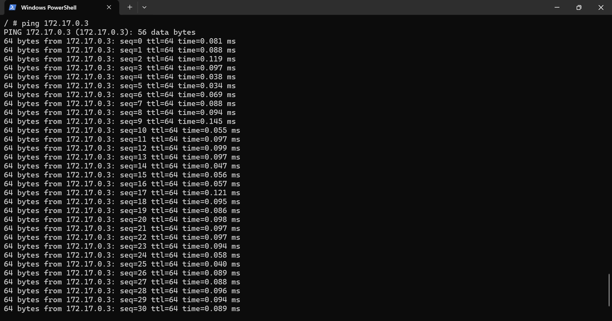

# KN03 - Netzwerk, Sicherheit

# A) Eignenes Netzwerk (100%)

Verwenden Sie die Befehle um die Unterschiede und Gemeinsamkeiten in den Netzwerken zu finden:

```bash
docker network create tbz

docker pull busybox:latest   

docker run --name=busybox1 -it --network=tbz busybox 

docker run --name=busybox2 -it --network=tbz busybox  

docker run --name=busybox3 -it --network=bridge busybox 

docker run --name=busybox4 -it --network=bridge busybox
```

### 1. Welche IP-Adressen haben busybox1, busybox2, busybox3 und busybox4 erhalten? Diese Aufgabe können Sie auch mit docker inspect lösen

IP:
`ifconfig`


```bash
busybox1: IP:172.18.0.2
busybox2: IP:172.18.0.3
busybox3: IP:172.17.0.2
busybox4: IP:172.17.0.3
```

### 2. Starten Sie eine interaktive Session auf busybox1 und geben Sie folgende Befehle ein, resp. finden Sie die korrekten Befehle:

1. Welcher Default-Gateway ist eingetragen? Welcher Container hat den gleichen?

Geteway:
`route -n`
 
```bash
busybox1: Gateway:172.18.0.1
busybox2: Gateway:172.18.0.1
busybox3: Gateway:172.17.0.1
busybox4: Gateway:172.17.0.1
```
 
2. ping busybox2

`ping busybox2`
 

 
3. ping busybox3

`ping busybox3`
 

 
4. ping IP-von-busybox2
 
`ping 172.18.0.3`
 

 
5. ping IP-von-busybox3
 
`ping busybox3`
 


### 3. Starten Sie eine interaktive Session auf busybox3 und geben Sie folgende Befehle ein:

1. Welcher Default-Gateway ist eingetragen? Welcher Container hat den gleichen?

Geteway:
`route -n`
 
```bash
busybox1: Gateway:172.18.0.1
busybox2: Gateway:172.18.0.1
busybox3: Gateway:172.17.0.1
busybox4: Gateway:172.17.0.1
```
Busybox3 und busybox4 haben den gleichen.

2. ping busybox1

`ping busybox1`
 


3. ping busybox4

`ping busybox4`
 


4. ping IP-von-busybox1

`ping 172.18.0.1`
 


5. ping IP-von-busybox4

`ping 172.17.0.3`
 


---

### Erklären Sie die Gemeinsamkeiten und Unterschiede. Wie kommen die Zustande und was ist Ihre Schlussfolgerung

**Gemeinsamkeiten:**
Beide Netze, das Standard-Bridge-Netz und das benutzerdefinierte "tbz"-Netz, ermöglichen die Kommunikation zwischen Containern, die in dasselbe Netzsegment (Subnetz) eingebunden sind.
    
**Unterschiede:**
Der Unterschied besteht darin, dass die Container mit dem Standard-Bridge-Netzwerk nur teilweise verbunden sind, nämlich nur über die IP-Adresse, die sich im Laufe der Zeit ändern kann. Wenn ich jedoch mein eigenes Netzwerk erstelle, kann ich Containernamen verwenden, die sich im Laufe der Zeit nicht ändern.

Da sich die beiden Container nicht im selben Subnetz befinden, können sie nicht miteinander kommunizieren. Die Container 3 & 4 im Bridge (default) Network befinden, haben sie keinen DNS-Eintrag für ihren Namen. Im custom Subnetz ist dies jedoch gewährleistet.

---

### Betrachten Sie nun KN02
In KN02 konnten die Container im gleichen Gateway nicht über den Containernamen kommunizieren, aber mit (--link) wird der Name mit der IP-Adresse verknüpft, was die Kommunikation der Container ermöglicht.

#### In welchem Netzwerk befanden sich die beiden Container?
    - busybox1: tbz
    - busybox3: bridge

#### Wieso konnten die miteinander reden?
Die beiden Container, die sich im „tbz“-Netz befanden, konnten über ihre Namen oder IP-Adressen miteinander kommunizieren, da sie sich im selben Netzsegment (Subnetz) befanden. Die Kommunikation zwischen Containern im gleichen Netzwerk ist standardmäßig aktiviert und erfordert keine besonderen Konfigurationen.