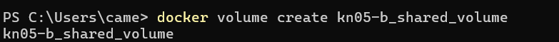

# KN05

[KN05.pdf](./Content/KN05.pdf)

---

# A) Bind mounts (40%)

1. Liste der Befehle die notwendig waren, um Container mit Volumen zu starten.

Estellt und betreibt einen Docker-Container mit nginx-Image und bind mount:

``` docker run --name kn05a -p 8080:80 -v D:/01-Backup/01-LP01WIN10JS/05-Tbz/01-Module/E-Portfolio-TBZ/M347/KN05/Content/Jan/:/usr/share/nginx/html/kn05a -d nginx ```

Zugriff auf die Container-Shell über das Terminal und start von output.sh:

``` docker exec -it 4520f9995593 bash /usr/share/nginx/html/kn05a/output.sh```


2. Erstellen Sie einen Screencast, der den beschriebenen Prozess zeigt. Testen Sie Ihn aber erst, bevor Sie den Screencast erstellen (Link in Grundlagen-Teil).


---

# B) Volumes (30%)

1. Liste der Befehle die notwendig waren, um Container mit Volumen zu starten.

Volumen erstellen:
``` docker volume create kn05-b_shared_volume ```



Erstellung von zwei Containern:
``` docker run -d --name kn05b-container-1 --mount source=kn05-b_shared_volume,target=/shared nginx ```
``` docker run -d --name kn05b-container-2 --mount source=kn05-b_shared_volume,target=/shared nginx ```


Die Konsole des ersten Containers wird geöffnet, um eine .txt-Datei zu erstellen und einige Inhalte in die Shared File zu schreiben.
``` docker exec -it kn05b-container-1 /bin/bash ```
``` echo "Content from container1" >> /shared/shared_file.txt ```

Die Konsole des zweiten Containers wird geöffnet, um den Inhalt der gleichen Datei zu lesen.
``` docker exec -it kn05b-container-2 /bin/bash ```
``` cat /shared/shared_file.txt ```


2. Erstellen Sie einen Screencast, der den beschriebenen Prozess zeigt. Testen Sie Ihn aber erst, bevor Sie den Screencast erstellen (Link in Grundlagen-Teil).

No Screen Cast (Personaly Shown)

# C) Speicher mit docker compose (30%)

1. Auszug mit dem Befehl mount im ersten Container, der zeigt, dass alle drei Speichertypen hinzugefügt wurden.


2. Auszug mit dem Befehl mount im zweiten Container, der zeigt, dass der Speichertyp hinzugefügt wurde.


3. docker compose Datei (yaml).
[docker-compose.yaml](./Content/C/docker-compose.yaml)