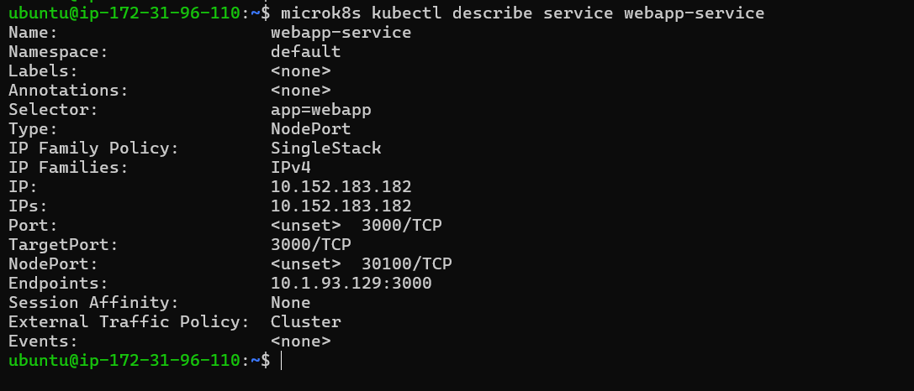
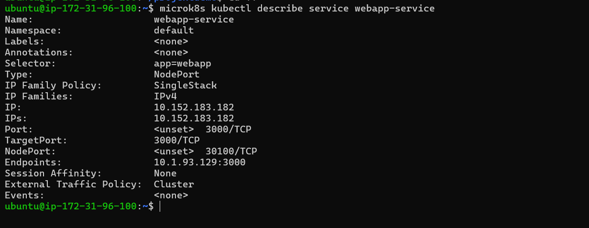
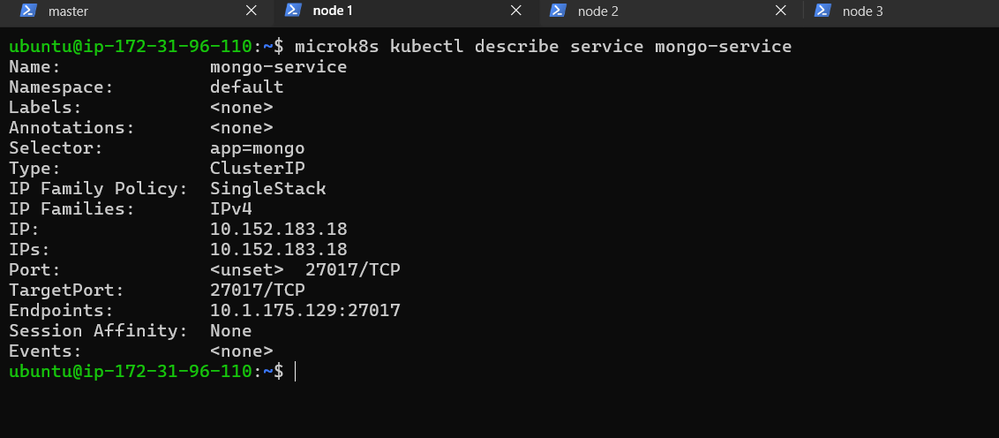
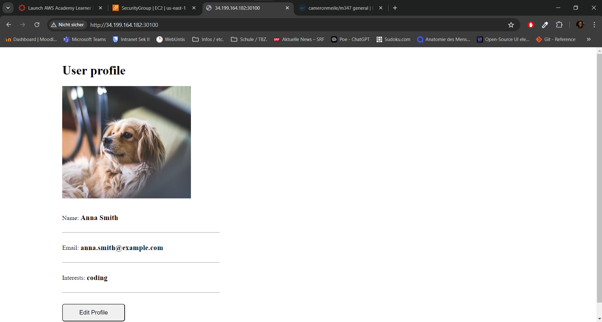

# KN07

### A) Begriffe und Konzepte erlernen (40%)

####  Erklären Sie den Unterschied zwischen Pods und Replicas mit eigenen Worten.

- **Pods**: Ein Pod ist die kleinste ausführbare Einheit in Kubernetes. Es kann eine oder mehrere Container enthalten, die gemeinsam auf einem Knoten laufen und sich Ressourcen teilen. Ein **Pod** repräsentiert eine einzelne Instanz einer Anwendung oder eines Mikroservices.

- **Replicas**: *Eine Replica ist eine Kopie eines Pods*, die von einem Deployment oder einer ReplicaSet-Steuerung verwaltet wird. Replicas ermöglichen die *Skalierung von Anwendungen*, indem mehrere Instanzen eines Pods erstellt werden. Jede Replica kann denselben oder unterschiedlichen Pods entsprechen.

#### Erklären Sie den Unterschied zwischen Service und Deployment mit eigenen Worten. 

- **Service**: Ein Service in Kubernetes ist eine Abstraktion, die Pods als eine einzige Anwendungseinheit darstellt und ihnen einen stabilen Netzwerknamen und eine IP-Adresse zuweist. Services ermöglichen die Kommunikation zwischen verschiedenen Teilen einer Anwendung, unabhängig davon, auf welchen Knoten sie sich befinden.

- **Deployment**: Ein Deployment definiert den Zustand einer Anwendung oder eines Pods, einschließlich der Anzahl der Replikate, die laufen sollen, und des verwendeten Containerimages. Deployments verwalten Pods und ermöglichen das Skalieren, Aktualisieren und Rollbacken von Anwendungen.

#### Welches Problem löst Ingress? Beantworten Sie die Frage in eigenen Worten.

- **Ingress**: Ingress ist eine Kubernetes-Ressource, die den Zugriff auf Dienste innerhalb eines Kubernetes-Clusters von außen ermöglicht. Ingress löst das Problem der Bereitstellung von externem Zugriff auf Anwendungen, die in einem Kubernetes-Cluster laufen. Es ermöglicht die Steuerung des Datenverkehrs basierend auf HTTP- und HTTPS-Routen und kann für die Lastverteilung und SSL-Terminierung verwendet werden.

#### Für was ist ein statefulset? Beantworten Sie die Frage in eigenen Worten. Geben Sie ein mögliches Beispiel - aber keine Datenbank. 

- **StatefulSet**: Ein **StatefulSet** ist eine Kubernetes-Ressource, die für die Bereitstellung von zustandsbehafteten Anwendungen in einem Kubernetes-Cluster verwendet wird. Im Gegensatz zu Pods in Deployments sind die Pods in einem StatefulSet eindeutig identifizierbar und haben stabile Netzwerkidentitäten sowie persistente Speicherungen. Ein mögliches Beispiel für die Verwendung eines StatefulSets ist die Bereitstellung von NoSQL-Datenbanken wie Apache Cassandra oder MongoDB, bei denen jeder Pod einen eindeutigen Zustand hat und über eine eindeutige Identität innerhalb des Clusters verfügt.

### B) Demo Projekt (60%)

#### Command Lines

Escape Vim FIle
`esc -> : -> w -> q`

```bash

sudo snap -i kubectl --classic

touch configmap.yaml
vim configmap.yaml

touch secret.yaml
vim secret.yaml

touch db.yaml
vim db.yaml

touch web.yaml
vim web.yaml

microk8s kubectl get pods
microk8s kubectl apply -f configmap.yaml
microk8s kubectl apply -f secret.yaml
microk8s kubectl apply -f db.yaml
microk8s kubectl apply -f web.yaml
microk8s kubectl get all

```

#### Files

- [configmap.yaml](./Content/B/configmap.yaml)
- [secret.yaml](./Content/B/secret.yamlyaml)
- [db.yaml](./Content/B/mongodb.yaml)
- [web.yaml](./Content/B/webapp.yaml)





